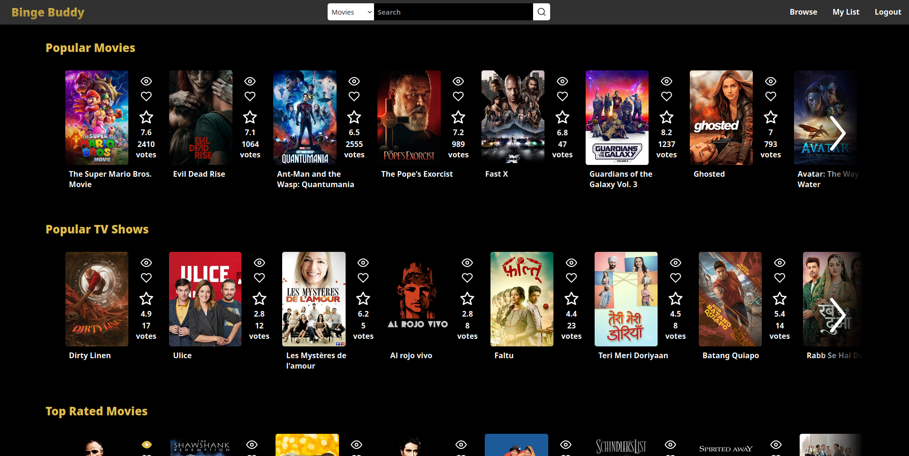

# BingeBuddy

BingeBuddy is a web application that allows you to keep track of your favorite TV shows and movies. It is built using Angular and Express.

The backend is a proxy server that forwards requests to the TMDB API and keeps track of the user's watchlist and watched items. This is backend exists in order to avoid having to expose the TMDB API key to the frontend and to keep your viewing data completely private.

## <b>Backend Installation</b>

### <b>Configuration</b>

The backend is configured using a config.json file, with the following parameters:

```json
{
    "apiKey":"tmdb_v3_api_key_here",
    "password":"your_password_here",
    "sourceUrl":"http://my_backend_host:8080",
    "targetUrl":"https://api.themoviedb.org/3",
    "port": 8080
}
```

### <b>Running the backend</b>

To run the backend, simply run the following command:

```bash
cd backend;
npm install;
npm run start
```

## <b>Frontend Installation</b>

### <b>Configuration</b>  

The frontend is configured using an environment.ts file in frontend/environment.ts with the following content:

```typescript
export const environment = {
    apiUrl: 'http://my_backend_host:8080',
};
```

### <b>Running the frontend</b>

To run the frontend, simply run the following command:

```bash
cd frontend;
npm install;
npm run build;
serve -s dist/binge-buddy -l 8081
```

Using serve is optional, you can also use any other webserver to serve the files in the dist/binge-buddy folder.

## <b>Screenshots</b>

Login screen:


Browse shows:


Show details:

